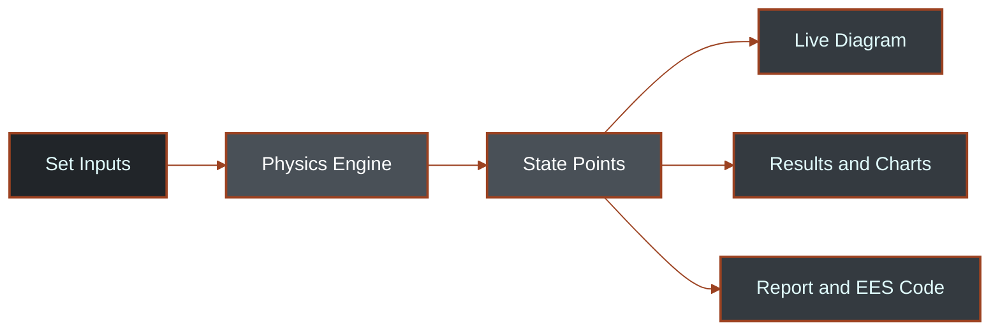
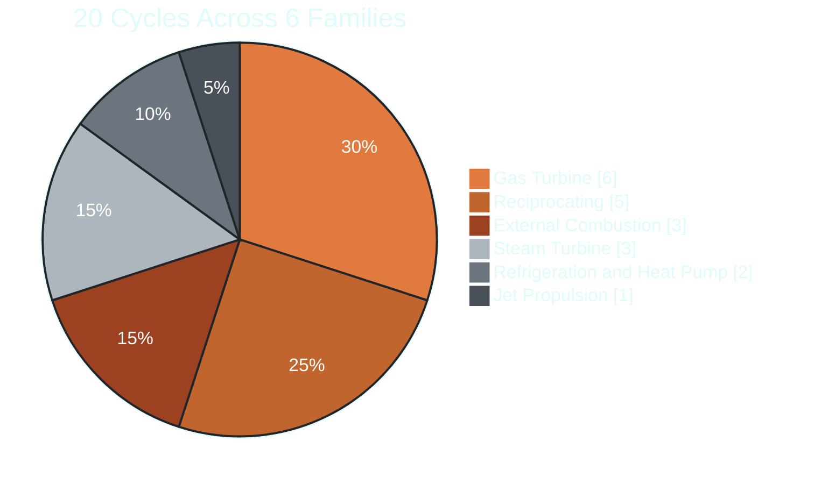

  

<h3 align="center">A Single File Web App for Exploring, Simulating, and Reporting on 20 Power Cycles</h3>

  
  
  

  
  
  

**[Open the Live App](https://tas-lab.vercel.app/)** &nbsp;•&nbsp; **[Report a Bug](../../issues)** &nbsp;•&nbsp; **[Request a Feature](../../issues)**

 

## Overview

TAS is an interactive thermodynamics platform for analyzing power, propulsion, and refrigeration cycles. Adjust an input and every diagram, table, chart, and equation updates instantly.

The whole app, including the physics engine, UI, charts, and report generator, runs client side from one HTML file. No frameworks, no build step, no backend.

 

## Screenshots

<table>
<tr>
<td width="50%">

**Cycle Setup and Analysis**

</td>
<td width="50%">

**Live Simulation**

</td>
</tr>
<tr>
<td width="50%">

**Results Table**

</td>
<td width="50%">

**Graphs**

</td>
</tr>
<tr>
<td width="50%">

**Compare Cycles**

</td>
<td width="50%">

**Parametric Study**

</td>
</tr>
<tr>
<td width="50%">

**Theory and Notes**

</td>
<td width="50%">

**Engineering Tools**

</td>
</tr>
<tr>
<td width="50%">

**Constants and Units**

</td>
<td width="50%">

**EES**

</td>
</tr>
<tr>
<td width="50%">

**Report**

</td>
<td width="50%"></td>
</tr>
</table>

 

## How It Works

Every output panel reads from the same state point data, so the diagram, charts, table, EES code, and report can never fall out of sync with each other.
 

## Supported Cycles

**Reciprocating (Piston) Engines**: Otto, Diesel, Dual, Atkinson, Miller
**External Combustion Engines**: Carnot, Stirling, Ericsson
**Gas Turbine Engines**: Simple, Regenerative, Reheat, Intercooled and Ultimate Brayton, Combined Cycle
**Jet Propulsion Engines**: Turbojet
**Steam Turbine Engines**: Ideal, Reheat, and Regenerative Rankine
**Refrigeration and Heat Pump Systems**: Vapor Compression Refrigeration, Heat Pump

Each cycle has its own governing equations, adjustable design parameters with realistic bounds, and dedicated theory notes.

 

## Tech Stack

Vanilla HTML, CSS, and JavaScript. No frameworks, no build tools, no npm dependencies. SVG powers the diagrams and charts, all rendered and updated in real time. Deployed as a single static file on Vercel, and fully usable offline once loaded.

 

## Contributing

1. Fork the repo
2. Create a branch: `git checkout -b feature/your-feature`
3. Commit your changes
4. Open a pull request

 

## References

Cengel, Y. A., and Boles, M. A. Thermodynamics: An Engineering Approach. McGraw Hill.
Moran, M. J., Shapiro, H. N., Boettner, D. D., and Bailey, M. B. Fundamentals of Engineering Thermodynamics. Wiley.

 

## License

Distributed under the MIT License. See `LICENSE` for details.

 

Built by <a href="https://github.com/fraisasghar">Frais Asghar</a>

If this project was useful to you, consider giving it a star. ⭐
  
<p3 align="center">Built for the Mechanical & Simulation community &nbsp;&middot;&nbsp; Happy building</p3>

